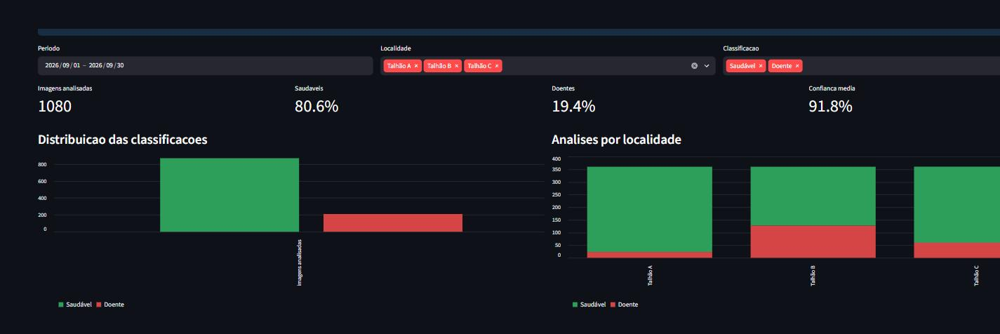

# AgroVision

[](https://github.com/Grupo-B-ES-FIAP/agrovision/actions/workflows/ci.yml)

Classificação de folhas de tomateiro por visão computacional, com painel
analítico e pipeline de dados.

O produtor fotografa folhas no campo. O AgroVision diz quais estão saudáveis e
quais apresentam sinais de doença. Cada análise fica guardada com data e
talhão. O painel mostra onde o problema está crescendo. Com isso, a aplicação
de defensivo vai para o talhão que precisa, e não para a fazenda inteira.

Projeto acadêmico AgroSmart, FIAP. Duas sprints: visão computacional na Fase 1,
organização e visualização dos dados na Fase 2.



## O que o sistema faz

| Aba | Função |
|---|---|
| Análise de folhas | Recebe uma ou mais imagens, com o local e a data da coleta. Classifica cada folha como saudável ou doente, com o percentual de confiança |
| Painel | Imagens analisadas, percentual de saudáveis e doentes, confiança média, contagem por talhão e evolução por dia. Filtros de período, local e classificação |
| Pipeline de dados | Mostra as três camadas de dados, permite reprocessar e exportar os resultados em CSV e JSON |

## Como rodar

Pré-requisito: Python 3.10 ou superior.

### Windows (PowerShell)

```powershell
python -m venv .venv
.\.venv\Scripts\python.exe -m pip install -e ".[dev]"
.\.venv\Scripts\python.exe -m streamlit run src/agrovision/app.py
```

### Linux e macOS

```bash
python3 -m venv .venv
source .venv/bin/activate
pip install -e ".[dev]"
streamlit run src/agrovision/app.py
```

Abra o endereço que o terminal mostrar, em geral `http://localhost:8501`.

Na primeira vez, a base está vazia e o painel abre com dados de demonstração.
Para ver dados reais, analise imagens na primeira aba. Há 200 imagens de
exemplo em `data/dataset/`.

## Como funciona

```
Imagem da folha
      |
      v
OpenCV: redimensiona para 128x128, converte para HSV
      |
      v
Histograma de 32 faixas por canal  ->  vetor de 96 números
      |
      v
Random Forest (scikit-learn)  ->  Saudável ou Doente + confiança
      |
      v
Camada Bronze (CSV)  ->  Silver (validada)  ->  Gold (indicadores)
                                 |
                                 v
                         Painel Streamlit
```

Matiz, saturação e brilho separam bem folha verde de folha com mancha
necrosada, e o histograma descreve a imagem sem depender do enquadramento da
foto. O detalhe de cada camada está em [docs/arquitetura.md](docs/arquitetura.md).

O pipeline em pandas é o caminho padrão, porque roda local e sem conta em
nuvem. Para escala, o mesmo fluxo existe em Apache Spark no notebook
[notebooks/pipeline_spark.py](notebooks/pipeline_spark.py), com tabelas Delta e
agendamento por Job no Databricks.

## Desempenho do modelo

| Métrica | Valor |
|---|---|
| Acurácia no conjunto de teste | 95,00% |
| Imagens de treino | 160 |
| Imagens de teste | 40 |
| Classificador | Random Forest, 200 árvores, semente 42 |

Os números saem de `models/metrics.json`, gravado pelo próprio treino. Para
reproduzir, rode `python scripts/treinar_modelo.py`. A semente é fixa, logo o
resultado é sempre o mesmo.

## Limites do protótipo

- O modelo classifica saudável ou doente. Não identifica a doença específica.
- Foi treinado em uma cultura, o tomateiro, com imagens de pinta-preta.
- A confiança exibida é a probabilidade que o modelo dá àquela imagem. Não é a
  acurácia do modelo.
- O desempenho cai com foto mal iluminada ou com fundo poluído, porque o vetor
  de características descreve cor.
- A base de demonstração é simulada e serve para apresentar o painel. Os
  registros simulados nunca entram na base real.

## Estrutura do projeto

```
src/agrovision/      aplicativo, pipeline ETL, visão computacional e esquema
scripts/             treino, importação em lote e geração da base de demonstração
tests/               testes do pipeline, da visão, do modelo e da exportação
notebooks/           pipeline em Apache Spark para o Databricks
data/dataset/        200 imagens de folhas, saudáveis e doentes
data/exemplos/       base de demonstração do painel
data/saida/          camadas Bronze, Silver e Gold, geradas em tempo de execução
models/              modelo treinado e métricas do treino
docs/                arquitetura, dicionário de dados e material dos vídeos
```

## Linha de comando

```bash
# Classificar uma pasta de imagens de uma vez
python scripts/importar_imagens.py data/dataset/doente "Talhão A" 2026-09-10

# Rodar o pipeline ETL
python -m agrovision.pipeline

# Treinar o modelo de novo
python scripts/treinar_modelo.py

# Gerar a base de demonstração
python scripts/gerar_dados_demo.py
```

## Testes

```bash
ruff check .
pytest
```

O GitHub Actions roda os dois comandos em cada push e em cada pull request.

## Documentação

- [Arquitetura e camadas de dados](docs/arquitetura.md)
- [Dicionário de dados](docs/dicionario-de-dados.md)
- [Origem do dataset](data/README.md)
- [Relatório técnico da Fase 1](docs/relatorio-tecnico-fase1.pdf)

## Vídeos de apresentação

- Fase 1: https://youtu.be/vDnr77sQk-g
- Fase 2: a publicar

## Histórico das sprints

A entrega da Fase 1 está preservada na tag `v1.0-fase1`, exatamente como foi
avaliada. Para ver aquele código:

```bash
git checkout v1.0-fase1
```

## Integrantes

| Nome | RM |
|---|---|
| Alvaro Matos | 553751 |
| Christian Gonzaga | 553775 |
| Filipe Oliveira | 552906 |
| Isabela Barcellos | 553746 |

## Licença

Código sob licença MIT, em [LICENSE](LICENSE). As imagens de
`data/dataset/` têm origem e condições próprias, descritas em
[data/README.md](data/README.md).
