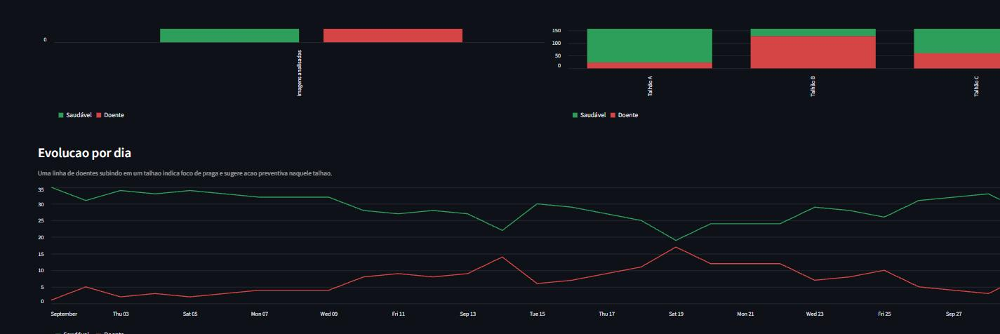

# Arquitetura do AgroVision

Este documento descreve o caminho de uma foto de folha até um indicador no
painel. Ele atende o item 1.2 da Fase 2, a integração com a fonte de dados.



A linha vermelha é o número de folhas doentes por dia. Quando ela sobe em um
talhão, existe foco de praga naquele talhão.

## Visão geral

```
                        +-------------------------+
  Foto da folha  ---->  |  Extração (OpenCV)      |
                        |  128x128, HSV,          |
                        |  3 histogramas de 32    |
                        +-----------+-------------+
                                    | vetor de 96 números
                                    v
                        +-------------------------+
                        |  Random Forest          |
                        |  (scikit-learn)         |
                        +-----------+-------------+
                                    | categoria + confiança
                                    v
  +--------------+      +-------------------------+
  | Local e data | ---> |  BRONZE                 |
  | da coleta    |      |  data/saida/            |
  +--------------+      |  analises.csv           |
                        +-----------+-------------+
                                    | valida e deduplica
                                    v
                        +-------------------------+
                        |  SILVER                 |
                        |  analises_tratadas.csv  |
                        +------+-----------+------+
                               |           |
                      agrega   |           |  fonte do painel
                               v           v
                    +------------------+  +------------------+
                    |  GOLD            |  |  Painel          |
                    |  indicadores.json|  |  Streamlit       |
                    +------------------+  +------------------+
```

## Etapa 1: extração de características

A imagem é reduzida para 128 por 128 pixels e convertida de BGR para HSV.
Cada canal do HSV gera um histograma de 32 faixas, normalizado. Os três
histogramas juntos formam um vetor de 96 números.

Por que HSV e não RGB: matiz, saturação e brilho separam folha verde de folha
com mancha necrosada de forma mais direta. Por que histograma e não a imagem
inteira: o histograma descreve a distribuição de cor sem depender de onde a
mancha está na foto.

O código está em `src/agrovision/vision.py`. Esse módulo é a única fonte do
vetor. O treino e o aplicativo chamam a mesma função, com as mesmas
constantes. Antes, a extração estava copiada em quatro arquivos, e uma
mudança no treino podia deixar o aplicativo prevendo com um vetor diferente.

## Etapa 2: classificação

Random Forest com 200 árvores, treinada em 160 imagens e avaliada em 40. A
semente é fixa em 42, logo o treino é reproduzível. A acurácia está em
`models/metrics.json`, gravada pelo próprio treino.

`src/agrovision/modelo.py` confere, na carga, se o modelo espera o mesmo
número de características que a extração produz. Se não bater, levanta erro
com o comando de correção. Sem essa conferência, a predição devolveria
resultado sem sentido e ninguém perceberia.

## Etapa 3: camadas de dados

O padrão de três camadas separa o dado cru do dado confiável. Cada camada tem
uma responsabilidade só.

### Bronze: ingestão

Arquivo: `data/saida/analises.csv`

Recebe uma linha por classificação, com o nome da imagem, a categoria, a
confiança, a data, a localidade e a origem. A Bronze aceita tudo, inclusive
linha repetida e valor estranho. Guardar o dado como ele chegou permite
reprocessar depois com uma regra nova.

Quem escreve: a aba Análise de folhas e o script
`scripts/importar_imagens.py`.

### Silver: transformação

Arquivo: `data/saida/analises_tratadas.csv`

Três regras, nesta ordem:

1. Converter a data e a confiança. Valor que não converte vira nulo.
2. Descartar a linha sem campo obrigatório, e a linha com categoria fora do
   contrato.
3. Descartar duplicata de nome da imagem, data e localidade.

A chave de deduplicação inclui data e localidade de propósito. A mesma folha
fotografada em outro dia é uma observação nova e precisa contar.

A Silver é a fonte do painel. O painel nunca lê a Bronze.

### Gold: carga

Arquivo: `data/saida/indicadores.json`

Indicadores agregados, prontos para consumo: total de imagens, percentual de
saudáveis e de doentes, confiança média, contagem por localidade e tendência
diária. Um painel externo, uma planilha ou outro sistema consome esse arquivo
sem precisar recalcular nada.

O arquivo também guarda o campo `impressao_bronze`, um resumo do conteúdo da
Bronze no momento da execução. O aplicativo usa esse campo para saber se
precisa reprocessar.

## Quando o pipeline roda

| Gatilho | O que acontece |
|---|---|
| Análise de imagens no aplicativo | Grava na Bronze e roda o pipeline inteiro |
| Abertura da aba Painel | Roda o pipeline somente se a Bronze mudou |
| Botão Reprocessar pipeline | Roda o pipeline inteiro |
| `python -m agrovision.pipeline` | Roda o pipeline inteiro |

A verificação de mudança compara o conteúdo da Bronze, e não a data de
modificação do arquivo. Duas gravações dentro do mesmo tique do relógio do
sistema dão a mesma data. Nesse caso, uma comparação por data deixaria o
painel mostrando dados velhos.

## Dois caminhos de processamento

| | pandas | Apache Spark |
|---|---|---|
| Arquivo | `src/agrovision/pipeline.py` | `notebooks/pipeline_spark.py` |
| Onde roda | Máquina local | Databricks |
| Formato de saída | CSV e JSON | Tabelas Delta |
| Volume | Centenas a milhares de análises | Milhões de análises |
| Agendamento | Manual ou pelo aplicativo | Job do Databricks |

O pandas é o caminho padrão porque roda sem conta em nuvem e sem instalação
extra. O Spark é o caminho de escala, e existe para o caso de várias fazendas
enviando imagens todos os dias. As duas versões aplicam as mesmas regras de
validação e produzem os mesmos indicadores. O notebook tem uma célula de
conferência para comparar os números.

## Decisões de projeto

**Por que CSV e não um banco de dados.** O enunciado aceita planilha ou banco
local. O CSV mantém o projeto rodando com um clone e um comando, sem serviço
para subir. A troca por Postgres ou Delta altera só a função de leitura e de
escrita, porque o esquema está isolado em `src/agrovision/esquema.py`.

**Por que a coluna se chama `acuracia` e guarda confiança.** O nome vem do
enunciado da Fase 1. Foi mantido para os arquivos das duas entregas
continuarem compatíveis. O valor é a probabilidade que o modelo dá àquela
imagem. O aplicativo, o painel e o dicionário de dados avisam isso.

**Por que os dados de demonstração ficam separados.** A base real tem poucos
registros e não conta nenhuma história. A base de demonstração tem 30 dias e
um foco de praga, e serve para apresentar o painel. A coluna `origem` marca
`Simulado`, e nenhum registro simulado entra na Bronze.
